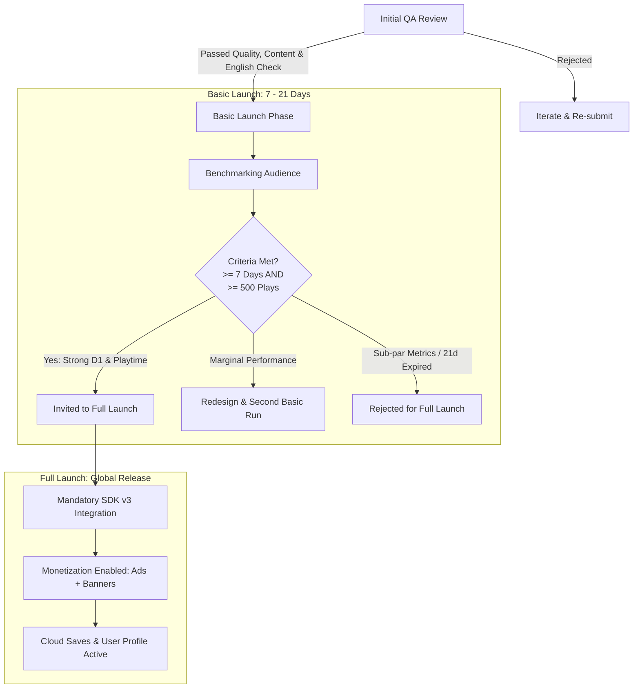
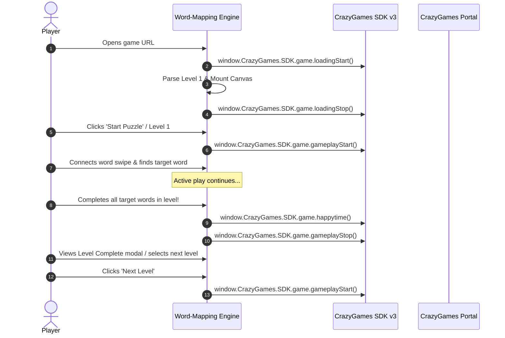
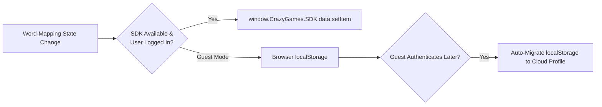
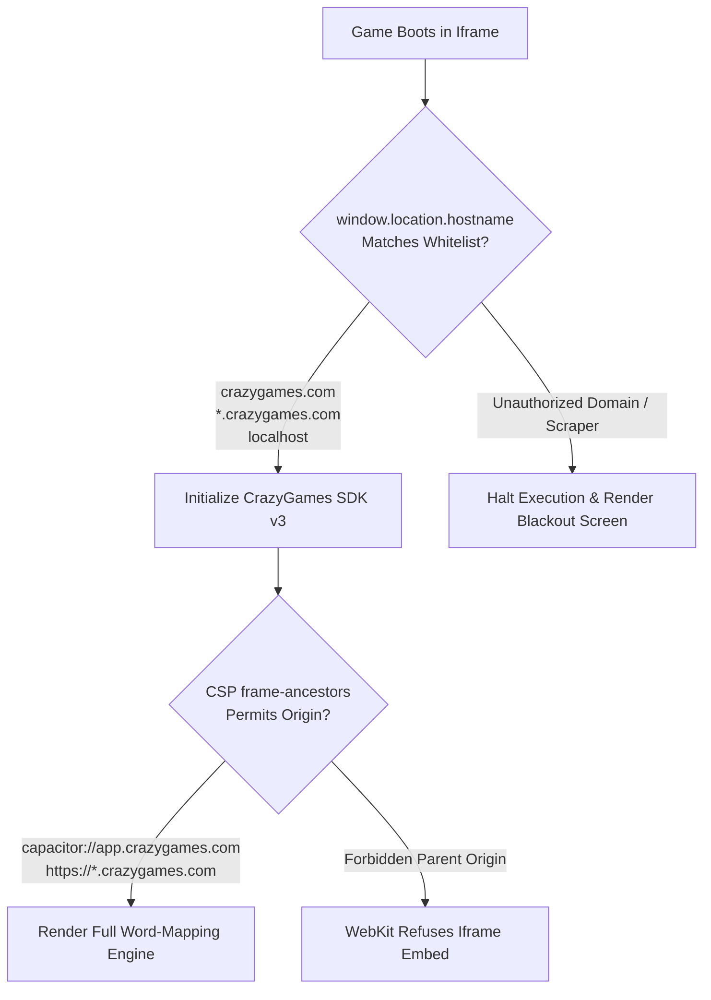

# CrazyGames Integration & Publishing Rulebook: Word-Mapping

> **Document Version:** 1.0.0  
> **Platform Target:** CrazyGames Web & Native App WebViews (iOS & Android)  
> **Game Title:** Word-Mapping (HTML5 High-Retention Word Puzzle)  
> **Target SDK:** CrazyGames SDK v3 (JavaScript / ECMAScript 6+)  
> **Primary Directory:** `/home/cat/Public/all-games/Word-Mapping/crzy/`  
> **Compliance Standard:** PEGI 12 / CrazyGames Developer Quality Guidelines

---

## Table of Contents

1. [Executive Summary & Platform Overview](#1-executive-summary--platform-overview)
2. [Phased Launch Architecture](#2-phased-launch-architecture)
3. [Technical & Delivery Constraints](#3-technical--delivery-constraints)
4. [CrazyGames SDK v3 Integration Guide](#4-crazygames-sdk-v3-integration-guide)
5. [Lifecycle Event Tracking (Word-Mapping Specific)](#5-lifecycle-event-tracking-word-mapping-specific)
6. [Monetization Architecture & Economy Design](#6-monetization-architecture--economy-design)
7. [Data Persistence & Cloud Saves](#7-data-persistence--cloud-saves)
8. [UX, Controls & Compliance Guardrails](#8-ux-controls--compliance-guardrails)
9. [Media Assets & Developer Portal Specifications](#9-media-assets--developer-portal-specifications)
10. [Security & Sitelock Architecture](#10-security--sitelock-architecture)
11. [Pre-Submission QA Verification Matrix & Checklist](#11-pre-submission-qa-verification-matrix--checklist)

---

## 1. Executive Summary & Platform Overview

### 1.1 The CrazyGames Ecosystem
CrazyGames represents one of the world's leading open web gaming portals, engaging over **50 million monthly active players** across desktop web, mobile web, and native hybrid applications (iOS and Android wrappers). Unlike closed mobile ecosystems governed by Apple and Google, CrazyGames offers immediate, zero-friction discovery and instant web gameplay without requiring app installations or local downloads.

For **Word-Mapping**—a high-retention educational word-connection and swipe puzzle—CrazyGames provides a vast, global demographic that actively seeks casual, cognitive, and brain-training puzzle experiences.

```
+-----------------------------------------------------------------------------------+
|                            CrazyGames Global Network                              |
|                           (>50M Monthly Active Users)                             |
+-----------------------------------------+-----------------------------------------+
                                          |
                 +------------------------+------------------------+
                 |                                                 |
                 v                                                 v
    +-------------------------+                       +-------------------------+
    |   Desktop Web Portal    |                       |   Mobile Web & Apps     |
    | (Chrome, Firefox, Edge, |                       | (Mobile Web, iOS App,   |
    |  Safari, Opera)         |                       |  Android App Wrapper)   |
    +------------+------------+                       +------------+------------+
                 |                                                 |
                 +------------------------+------------------------+
                                          |
                                          v
                         +---------------------------------+
                         |   Word-Mapping HTML5 Engine     |
                         |   - Canvas Swipe Interaction    |
                         |   - 10-15 Target Words / Level  |
                         |   - Realtime Dictionary Engine  |
                         |   - Web Audio Procedural Chimes |
                         +---------------------------------+
```

### 1.2 Demographic & Rating Compliance (PEGI 12)
CrazyGames caters primarily to an audience aged 13 and above. Content distributed on the platform must adhere strictly to **Pan European Game Information (PEGI) 12** standards:
* **Lexical Safety:** Word-Mapping's vocabulary database (`words.json`, `words.csv`) and dynamic dictionary validator must exclude hate speech, graphic violence, sexual terminology, profanity, and illegal substance references.
* **No Unregulated Gambling:** Coin mechanics within Word-Mapping must serve strictly as in-game progression and cosmetic unlocking tools. Coins cannot be redeemed for real-world currency or cash-equivalent prizes.
* **Kids Portal Separation:** While CrazyGames operates a dedicated children's portal, advertising and monetization are completely disabled in that environment. Word-Mapping targets the primary 13+ platform, monetizing through opt-in rewarded video, midgame breaks, and non-intrusive banners.

### 1.3 Language & Localization Mandate
Full **English language support is mandatory** for initial Quality Assurance approval. Submissions lacking complete English menus, UI labels, tutorials, and dictionaries face immediate rejection.
* Word-Mapping fulfills this requirement natively: all target words, level grids, hints, and instructional HUD elements are crafted in clear, concise English.
* The game's unique **Word Translation Feature** (which allows players to unlock multi-language translations and semantic clues for discovered words) functions as a premium, rewarded retention mechanic that supplements the core English gameplay.

---

## 2. Phased Launch Architecture

To protect platform quality and ensure that user retention is measured accurately without the confounding influence of ad fatigue, CrazyGames enforces a mandatory, multi-stage publication pipeline.



### 2.1 Initial Quality Assurance (QA)
Before appearing publicly, Word-Mapping is evaluated by CrazyGames QA engineers against strict operational baselines. Rejection criteria include:
1. Critical runtime bugs, frozen canvas states, or uncaught JavaScript exceptions.
2. Unclear onboarding or broken interaction loops on first load.
3. Lack of English text in core interfaces.
4. Custom in-game fullscreen buttons that conflict with portal chrome.
5. Direct unedited clones or low-effort template submissions.

### 2.2 The Basic Launch Phase
The Basic Launch is an empirical sandbox deployed to a segmented audience:
* **Duration:** Minimum of 7 consecutive days; maximum testing ceiling of 21 days.
* **Play Volume:** Must accumulate a minimum of 500 validated plays. Even if Word-Mapping hits 500 plays on Day 2, it **must remain active for the full 7-day period** to stabilize metric calculations.
* **Zero Monetization Rule:** **All video ads, interstitials, and banners must remain strictly disabled.** This guarantees that Day 1 retention, average playtime, and level conversion rates reflect pure gameplay quality without monetization friction.
* **Outcome Benchmarking:** Engagement metrics are compared against platform genre averages. If Word-Mapping achieves satisfactory retention benchmarks, the title receives an official invitation to Full Launch.

### 2.3 The Full Launch Phase
Upon passing Basic Launch benchmarks, Word-Mapping transitions to global release:
* CrazyGames SDK v3 integration becomes strictly mandatory.
* Monetization features activate (Rewarded video ads, Midgame breaks, 300x250 Banners).
* User authentication and Cloud Save synchronization activate via `window.CrazyGames.SDK.data`.

### 2.4 Launch Comparison Matrix

| Architectural Dimension | Basic Launch Phase | Full Launch Phase |
| :--- | :--- | :--- |
| **SDK Status** | Optional (Mock/Disabled) | **Mandatory** (`crazygames-sdk-v3.js`) |
| **Monetization Engine** | **Strictly Disabled (Zero Ads)** | **Active** (Rewarded, Interstitial, Banner) |
| **Initial Download Size** | $\le$ 50 MB | $\le$ 50 MB |
| **Total Build Footprint** | $\le$ 50 MB (without SDK) | $\le$ 250 MB |
| **Total File Count** | $\le$ 1,500 files | $\le$ 1,500 files |
| **Data Persistence** | Local Storage fallback | Persistent CrazyGames Account Cloud Sync |
| **Rollout Scope** | Controlled platform sample | Global portal distribution + mobile app apps |
| **Patch Latency** | Same-day cache invalidation | Same-day cache invalidation |

---

## 3. Technical & Delivery Constraints

### 3.1 Network Payloads & File Budget
Web players abandon slow-loading pages rapidly. Word-Mapping is engineered for ultra-lightweight delivery:
* **Initial Download:** $\le$ 50 MB. (Word-Mapping's complete distribution bundle is under 1.5 MB, executing within 3% of the platform ceiling).
* **Total File Size:** $\le$ 250 MB aggregate.
* **Total File Count:** $\le$ 1,500 files. (Word-Mapping utilizes fewer than 20 files, eliminating HTTP request overhead).

### 3.2 Time-to-First-Frame (TTFF)
Time-to-First-Frame measures the exact duration from the initial page request until the game invokes `window.CrazyGames.SDK.game.gameplayStart()`.
* **$\le$ 100 ms:** Perceived as instantaneous; premium tier retention.
* **$\le$ 1.0 s:** Fluid user flow; acceptable industry standard.
* **$\ge$ 10.0 s:** Catastrophic abandonment rate (>60% player bounce).

#### Word-Mapping TTFF Optimization Pipeline
1. **Asynchronous Lexicon Streaming:** Load the lightweight target word list for Level 1 immediately; defer background parsing of the full secondary dictionary (`words.json`).
2. **Zero External Font Dependencies:** Utilize native system font stacks (`system-ui`, `-apple-system`, `BlinkMacSystemFont`, `Segoe UI`, `Roboto`, `sans-serif`) to eliminate render-blocking font downloads.
3. **Procedural Web Audio Engine:** Word-Mapping eliminates heavy `.mp3` and `.ogg` asset downloads by synthesizing UI clicks, letter connections, and victory fanfares procedurally via the native Web Audio API (`audio.js`).

```
Initial HTML/CSS/JS Download (Instant: ~150KB)
           |
           v
Initialize Native Web Audio Context (Procedural Synthesis: 0 bytes downloaded)
           |
           v
Mount Canvas Grid & Parse Level 1 Words (~12KB)
           |
           v
Invoke SDK loadingStop() + gameplayStart() (TTFF < 350ms achieved!)
           |
           v
Asynchronously stream full dictionary (words.json) in background worker
```

### 3.3 Asset & Compression Optimization
* **Brotli Compression:** For production deployments on custom servers or CDNs, Brotli (`.br`) compression must be prioritized over Gzip (`.gz`), providing a 20–25% reduction in transfer payload.
* **Sprite & Icon Optimization:** All vector elements (`icon.svg`) must be minified, with unnecessary metadata, comments, and empty XML tags stripped.

### 3.4 Responsive Iframe Resolutions
CrazyGames embeds titles within responsive iframes. The user interface must dynamically scale while preserving crisp text legibility at a `devicePixelRatio` of 1.0 through high-DPI displays.

| Platform Target | Display Mode | Target Resolution (Pixels) | Aspect Ratio |
| :--- | :--- | :--- | :--- |
| **Desktop** | Non-Fullscreen (Standard) | 907 x 510 | ~16:9 |
| **Desktop** | Non-Fullscreen (Expanded) | 1216 x 684 | 16:9 |
| **Desktop** | Non-Fullscreen (Intermediate) | 1077 x 606 | ~16:9 |
| **Desktop** | Non-Fullscreen (Compact) | 821 x 462 | ~16:9 |
| **Desktop** | Fullscreen HD | 1920 x 1080 | 16:9 |
| **Desktop** | Fullscreen WXGA | 1366 x 768 | ~16:9 |
| **Desktop** | Fullscreen Standard | 1280 x 720 | 16:9 |
| **Mobile** | Standard Web / Wrapper | 800 x 450 | 16:9 Landscape |
| **Mobile** | Portrait Mode | 450 x 800 | 9:16 Portrait |
| **Tablet** | Standard Landscape | 1080 x 607 | ~16:9 |

### 3.5 Safe Area Insets for Mobile App Wrappers
CrazyGames distributes games inside native iOS and Android applications via native WebViews. The interface must dynamically avoid device notches, rounded screen corners, and home indicator bars.

```css
/* Word-Mapping Safe Area Configuration (crzy/style.css) */
:root {
  --safe-top: env(safe-area-inset-top, 0px);
  --safe-bottom: env(safe-area-inset-bottom, 0px);
  --safe-left: env(safe-area-inset-left, 0px);
  --safe-right: env(safe-area-inset-right, 0px);
}

#game-app {
  padding-top: var(--safe-top);
  padding-bottom: var(--safe-bottom);
  padding-left: var(--safe-left);
  padding-right: var(--safe-right);
  box-sizing: border-box;
}

#top-bar {
  margin-top: var(--safe-top);
}
```

---

## 4. CrazyGames SDK v3 Integration Guide

### 4.1 Script Tag Injection
To integrate the official CrazyGames SDK v3, include the script tag inside the `<head>` section of `index.html`. It must execute before any game logic scripts:

```html
<!DOCTYPE html>
<html lang="en">
<head>
  <meta charset="UTF-8">
  <meta name="viewport" content="width=device-width, initial-scale=1.0, maximum-scale=1.0, user-scalable=no, viewport-fit=cover">
  <title>Word-Mapping</title>
  
  <!-- Official CrazyGames SDK v3 Script Tag -->
  <script src="https://sdk.crazygames.com/crazygames-sdk-v3.js"></script>
  
  <!-- Game Stylesheet -->
  <link rel="stylesheet" href="style.css">
</head>
<body>
  <!-- Game Canvas & DOM -->
  <script src="audio.js"></script>
  <script src="gameConfig.js"></script>
  <script src="crazygames-adapter.js"></script>
  <script src="app.js"></script>
</body>
</html>
```

### 4.2 Asynchronous Initialization
CrazyGames SDK v3 utilizes modern Promises. Legacy callback initialization is completely deprecated.

```javascript
/**
 * Asynchronous initialization sequence for Word-Mapping
 */
async function initCrazySDK() {
  if (typeof window.CrazyGames === 'undefined' || !window.CrazyGames.SDK) {
    console.warn("[CrazySDK] SDK script not detected. Operating in offline standalone fallback mode.");
    return false;
  }

  try {
    // Initializing SDK v3
    await window.CrazyGames.SDK.init();
    console.log("[CrazySDK] SDK v3 successfully initialized!");
    return true;
  } catch (error) {
    console.error("[CrazySDK] Initialization rejected:", error);
    return false;
  }
}
```

### 4.3 Environment Detection & Runtime States
The SDK is context-aware and reports its running environment via `window.CrazyGames.SDK.environment`:

```javascript
const env = window.CrazyGames.SDK.environment;

switch (env) {
  case 'local':
    // Active during local development on localhost or 127.0.0.1.
    // Ads show visual placeholder overlays; data APIs return mock responses.
    console.log("[CrazySDK] Running in Local Test Environment.");
    break;

  case 'crazygames':
    // Active on production crazygames.com domain and mobile app wrappers.
    // Full monetization, cloud saves, and platform tracking active.
    console.log("[CrazySDK] Running in Live CrazyGames Production.");
    break;

  case 'disabled':
    // Triggered if the game is hotlinked or embedded on unauthorized external domains.
    // SDK APIs reject or halt execution.
    console.warn("[CrazySDK] Running on unauthorized domain. Features disabled.");
    break;
}
```

> **Testing on Custom IPs / Devices:** To force `local` testing mode when running on a local network IP or mobile staging device, append the query parameter to the URL:  
> `http://192.168.1.100:8080/index.html?useLocalSdk=true`

---

## 5. Lifecycle Event Tracking (Word-Mapping Specific)

Accurate lifecycle reporting is critical. CrazyGames relies on these triggers to compute gameplay retention metrics, benchmark titles during Basic Launch, and manage host browser resource allocation.



### 5.1 Lifecycle API Specification

```javascript
/**
 * Word-Mapping Lifecycle Management Adapter
 */
const CrazyLifecycle = {
  // 1. Initial Asset & Lexicon Loading State
  notifyLoadingStart() {
    if (window.CrazyGames?.SDK?.game?.loadingStart) {
      window.CrazyGames.SDK.game.loadingStart();
      console.log("[Lifecycle] loadingStart notified");
    }
  },

  // 2. Ready to Play / Menu Loaded State
  notifyLoadingStop() {
    if (window.CrazyGames?.SDK?.game?.loadingStop) {
      window.CrazyGames.SDK.game.loadingStop();
      console.log("[Lifecycle] loadingStop notified");
    }
  },

  // 3. Active Puzzle Solving State (Level started, resumed from pause)
  notifyGameplayStart() {
    if (window.CrazyGames?.SDK?.game?.gameplayStart) {
      window.CrazyGames.SDK.game.gameplayStart();
      console.log("[Lifecycle] gameplayStart notified");
    }
  },

  // 4. Inactive Puzzle State (Level completed, paused, menu opened, level select open)
  notifyGameplayStop() {
    if (window.CrazyGames?.SDK?.game?.gameplayStop) {
      window.CrazyGames.SDK.game.gameplayStop();
      console.log("[Lifecycle] gameplayStop notified");
    }
  },

  // 5. Celebration Event (Level clear, bonus streak, theme unlocked)
  notifyHappyTime() {
    if (window.CrazyGames?.SDK?.game?.happytime) {
      window.CrazyGames.SDK.game.happytime();
      console.log("[Lifecycle] happytime celebration triggered");
    }
  }
};
```

### 5.2 Mapping Events to Word-Mapping Triggers

| Lifecycle API Method | Word-Mapping Trigger Condition | Rationale & Requirements |
| :--- | :--- | :--- |
| `loadingStart()` | Game script initialization; loading `words.json` & audio synthesizer. | Signals to CrazyGames wrapper that initial assets are fetching. |
| `loadingStop()` | Canvas rendered, level grid ready, start button visible. | Stops platform loading spinner; contributes directly to TTFF score. |
| `gameplayStart()` | Player taps "Play", starts Level $N$, resumes from pause modal, or launches Daily Challenge. | Begins active playtime counter; enables interaction analytics. |
| `gameplayStop()` | Player pauses game, opens Level Select modal, enters Settings, or finishes a level. | Pauses playtime tracking. Prevents distorted engagement metrics. |
| `happytime()` | 1. All target words found (Level Victory).<br>2. Finding a rare bonus dictionary word (+5 coins).<br>3. Claiming 7-day Daily Streak (+100 coins).<br>4. Unlocking a new board theme palette. | Triggers portal-level celebratory visual effects. **Do not spam on every single letter tap.** |

### 5.3 Synchronizing Platform Audio (`muteAudio`)
CrazyGames provides an external audio toggle in the platform navigation wrapper. When the user mutes the game from the CrazyGames portal, the SDK communicates this state. Word-Mapping must prioritize the platform mute command over local volume settings:

```javascript
/**
 * Hook platform mute state directly into Word-Mapping SoundEngine
 */
function syncCrazyAudioSettings() {
  if (window.CrazyGames?.SDK?.game?.onAudioMuteChanged) {
    window.CrazyGames.SDK.game.onAudioMuteChanged((isMuted) => {
      console.log("[CrazyAudio] Platform mute changed:", isMuted);
      if (window.soundEngine && typeof window.soundEngine.setMuted === 'function') {
        window.soundEngine.setMuted(isMuted);
      }
    });
  }
}
```

---

## 6. Monetization Architecture & Economy Design

Word-Mapping's economy is centered on progression hints, level skips, word translations, and theme customization. Monetization on CrazyGames operates across three primary formats: **Rewarded Video Ads**, **Midgame (Interstitial) Video Ads**, and **Banner Ads**.

```
                           +--------------------------------+
                           |  Word-Mapping Monetization Hub |
                           +---------------+----------------+
                                           |
         +---------------------------------+---------------------------------+
         |                                 |                                 |
         v                                 v                                 v
+-----------------------+       +-----------------------+       +-----------------------+
|  Rewarded Video Ads   |       | Midgame Interstitials |       |      Banner Ads       |
| (High Yield / Opt-In) |       | (Natural Transitions) |       |  (Passive Screen HUD) |
+-----------------------+       +-----------------------+       +-----------------------+
| 1. Free Translation   |       | 1. Between Levels     |       | 1. Main Menu Screen   |
| 2. +50 Coins Bonus    |       | 2. Post-Daily Puzzle  |       | 2. Level Complete     |
| 3. Out-of-Coins Hint  |       | 3. Respects 3m Cooldown|      | 3. Dictionary Modal   |
+-----------------------+       +-----------------------+       +-----------------------+
```

### 6.1 Rewarded Video Advertisements
Rewarded ads yield the highest eCPM on CrazyGames and reinforce player retention through a transparent **Value Exchange**. Players willingly view an advertisement in return for immediate utility.

#### Rewarded Placements in Word-Mapping
1. **Translate Feature Ad (Zero Coin Cost):**
   * *Normal Cost:* 9 coins per word (`TRANSLATION_COST: 9`).
   * *Rewarded Offer:* "Watch a quick video to translate this word and reveal semantic clues for free!"
2. **Economy Coin Booster (+50 Coins):**
   * *Placement:* Accessible via the coin badge in the top HUD or within the Level Select modal.
   * *Rewarded Offer:* Instant disbursement of +50 coins (`AD_REWARD_COINS: 50`).
3. **Emergency Hint Fallback:**
   * *Context:* Player has fewer than 5 coins and taps the Hint lightbulb (`HINT_COST: 5`).
   * *Rewarded Offer:* "Out of coins? Watch a video to reveal the next word!"

#### Dynamic Reward Scaling Rationale
While +50 coins is rewarding in early stages (Levels 1–5), later stages present grids with up to 15 complex words where skip costs rise to 130 coins. Scaling the reward dynamically ensures ongoing relevance:
$$\text{Reward Coins} = \max\left(50, \ \min\left(120, \ 30 + (\text{currentLevel} \times 4)\right)\right)$$

#### Rewarded Ad Implementation Recipe
The SDK requires three core callbacks: `adStarted`, `adFinished`, and `adError`. Audio must be muted and gameplay timers paused during playback:

```javascript
/**
 * Request a Rewarded Ad for Word-Mapping
 * @param {string} rewardType - 'translate' | 'coins' | 'hint'
 * @param {Function} onRewardSuccess - Callback executed upon valid reward completion
 */
function showRewardedAd(rewardType, onRewardSuccess) {
  if (!window.CrazyGames?.SDK?.ad?.requestAd) {
    console.warn("[Monetization] SDK not active. Simulating reward for development.");
    if (typeof onRewardSuccess === 'function') onRewardSuccess();
    return;
  }

  // 1. Temporarily pause gameplay & countdown timer
  const wasTimerRunning = window.wordMappingGame?.isTimerActive;
  if (wasTimerRunning) {
    window.wordMappingGame.pauseTimer();
  }
  
  // 2. Stop gameplay reporting during ad overlay
  CrazyLifecycle.notifyGameplayStop();

  const callbacks = {
    adStarted: () => {
      console.log(`[Rewarded Ad] Started: ${rewardType}`);
      // Mute all procedural Web Audio
      if (window.soundEngine && typeof window.soundEngine.setMuted === 'function') {
        window.soundEngine.setMuted(true);
      }
      // Block canvas touch interactions
      if (window.wordMappingGame) {
        window.wordMappingGame.inputLocked = true;
      }
    },

    adFinished: () => {
      console.log(`[Rewarded Ad] Finished successfully: ${rewardType}`);
      
      // Restore user audio settings
      if (window.soundEngine && typeof window.soundEngine.setMuted === 'function') {
        const userMutePref = localStorage.getItem('wordmapping_muted') === 'true';
        window.soundEngine.setMuted(userMutePref);
      }

      // Unlock interaction
      if (window.wordMappingGame) {
        window.wordMappingGame.inputLocked = false;
        if (wasTimerRunning) window.wordMappingGame.resumeTimer();
      }

      // Resume gameplay tracking
      CrazyLifecycle.notifyGameplayStart();

      // Disburse specific reward
      if (typeof onRewardSuccess === 'function') {
        onRewardSuccess();
      }

      // Save updated economy state to Cloud Data
      if (window.CrazyDataPersistence) {
        window.CrazyDataPersistence.saveGameState();
      }
    },

    adError: (error, errorData) => {
      console.error(`[Rewarded Ad] Error encountered:`, error, errorData);
      
      // Safely recover audio and input state
      if (window.soundEngine && typeof window.soundEngine.setMuted === 'function') {
        const userMutePref = localStorage.getItem('wordmapping_muted') === 'true';
        window.soundEngine.setMuted(userMutePref);
      }

      if (window.wordMappingGame) {
        window.wordMappingGame.inputLocked = false;
        if (wasTimerRunning) window.wordMappingGame.resumeTimer();
      }

      // Resume lifecycle
      CrazyLifecycle.notifyGameplayStart();

      // Non-punitive user toast notification
      showToastNotification("Ad could not be loaded. Please try again in a few moments.");
    }
  };

  // Request rewarded ad from CrazyGames SDK v3
  window.CrazyGames.SDK.ad.requestAd("rewarded", callbacks);
}
```

### 6.2 Midgame (Interstitial) Advertisements
Midgame video ads form the baseline for programmatic revenue. However, intrusive midgame ads represent the single highest driver of player churn.
* **Strict Placement Rule:** Midgame ads must **only** appear at natural, expected pause points. For Word-Mapping, the exclusive valid trigger is the **transition between completed levels** (e.g., clicking "Next Level" after reviewing level score).
* **Absolute Prohibition During Play:** **NEVER** interrupt active word swiping, letter selection, or countdown timer countdowns.
* **Adherence to Platform Cooldown (3-Minute Rule):** The CrazyGames SDK inherently enforces a **3-minute cooldown** between interstitial impressions. Calling `requestAd("midgame")` prior to cooldown expiry is automatically and silently skipped by the SDK. Developers should trigger the call at every natural level break; the SDK handles pacing automatically.

```javascript
/**
 * Request a Midgame Interstitial at natural level transition
 * @param {Function} onContinue - Callback to advance to the next level
 */
function showMidgameBreak(onContinue) {
  if (!window.CrazyGames?.SDK?.ad?.requestAd) {
    if (typeof onContinue === 'function') onContinue();
    return;
  }

  CrazyLifecycle.notifyGameplayStop();

  const callbacks = {
    adStarted: () => {
      console.log("[Midgame Ad] Started");
      if (window.soundEngine) window.soundEngine.setMuted(true);
    },
    adFinished: () => {
      console.log("[Midgame Ad] Finished");
      if (window.soundEngine) {
        const userMuted = localStorage.getItem('wordmapping_muted') === 'true';
        window.soundEngine.setMuted(userMuted);
      }
      if (typeof onContinue === 'function') onContinue();
    },
    adError: (error, errorData) => {
      console.warn("[Midgame Ad] Skipped or Error (e.g. cooldown active):", error);
      if (window.soundEngine) {
        const userMuted = localStorage.getItem('wordmapping_muted') === 'true';
        window.soundEngine.setMuted(userMuted);
      }
      if (typeof onContinue === 'function') onContinue();
    }
  };

  window.CrazyGames.SDK.ad.requestAd("midgame", callbacks);
}
```

### 6.3 Banner Advertisements (300x250)
Banner advertisements generate continuous passive impressions across stationary UI views without interrupting user interaction.

#### Placement & Timing Rules
1. **Permitted Containers:**
   * Main Menu / Start Screen.
   * Level Complete summary modal.
   * Dictionary / Word Definition modal.
2. **The 5-Second Visibility Mandate:** Banners **must remain visible on-screen for at least 5 continuous seconds** to qualify as a valid, monetizable impression. Do not place banners in modals that players dismiss in 1–2 seconds.

```html
<!-- Banner Container Definition inside Modal or Menu -->
<div id="crazy-banner-300x250" class="banner-wrapper"></div>
```

```javascript
/**
 * Request a 300x250 Banner in Word-Mapping
 */
async function loadCrazyBanner() {
  if (!window.CrazyGames?.SDK?.banner?.requestBanner) return;

  const container = document.getElementById("crazy-banner-300x250");
  if (!container) return;

  try {
    await window.CrazyGames.SDK.banner.requestBanner({
      id: "crazy-banner-300x250",
      width: 300,
      height: 250,
    });
    console.log("[CrazyBanner] 300x250 banner successfully loaded.");
  } catch (err) {
    console.error("[CrazyBanner] Banner failed to render:", err);
  }
}

/**
 * Clean up banner container when navigating away
 */
function clearCrazyBanner() {
  if (window.CrazyGames?.SDK?.banner?.clearBanner) {
    window.CrazyGames.SDK.banner.clearBanner("crazy-banner-300x250");
  }
}
```

### 6.4 Adblock Detection & Compliance
CrazyGames provides an API to check if the player is using an ad-blocking extension:

```javascript
async function verifyAdblockStatus() {
  if (!window.CrazyGames?.SDK?.ad?.hasAdblock) return false;

  try {
    const isBlocking = await window.CrazyGames.SDK.ad.hasAdblock();
    return isBlocking;
  } catch (e) {
    return false;
  }
}
```

#### Non-Punitive Implementation Policy
* **Strict Rule:** **Core gameplay must never be locked behind an adblock wall.** Players with adblockers enabled must be permitted to play all levels, swipe words, and access basic progression.
* **Permitted Action:** Secondary incentives may be gently gated. For example, if a player with an active adblocker taps "+50 Coins Ad", display a gentle dialog:
  > *"It looks like your ad blocker is active! To receive free coin bonuses and free word translations, please consider whitelisting CrazyGames."*

---

## 7. Data Persistence & Cloud Saves

### 7.1 CrazyGames Cloud Data Architecture
CrazyGames SDK v3 exposes a synchronized key-value storage module (`window.CrazyGames.SDK.data`) that links player data directly to their CrazyGames account. This ensures seamless cross-device synchronization (e.g., advancing on desktop web and continuing on mobile).



### 7.2 Data Schema Specification
Word-Mapping serializes its state into structured JSON entries:

```json
{
  "wordmapping_current_level": 5,
  "wordmapping_coins": 125,
  "wordmapping_unlocked_levels": [1, 2, 3, 4, 5],
  "wordmapping_bonus_words_count": 14,
  "wordmapping_daily_streak": {
    "count": 3,
    "lastClaimDate": "2026-10-02"
  },
  "wordmapping_unlocked_themes": ["ocean_blue", "emerald_forest"],
  "wordmapping_settings": {
    "soundEnabled": true,
    "vibrationEnabled": true
  }
}
```

### 7.3 Unified Cloud Persistence Adapter

```javascript
/**
 * Hybrid Persistence Controller: CrazyGames Cloud + Local Fallback
 */
const CrazyDataPersistence = {
  // Save key-value pair
  async saveItem(key, value) {
    const stringVal = typeof value === 'object' ? JSON.stringify(value) : String(value);

    // 1. Primary: CrazyGames Cloud Data module
    if (window.CrazyGames?.SDK?.data?.setItem) {
      try {
        await window.CrazyGames.SDK.data.setItem(key, stringVal);
        return;
      } catch (err) {
        console.warn(`[Persistence] Cloud save failed for ${key}, falling back to localStorage:`, err);
      }
    }

    // 2. Fallback: Browser localStorage
    try {
      localStorage.setItem(key, stringVal);
    } catch (e) {
      console.error("[Persistence] localStorage unavailable:", e);
    }
  },

  // Load key-value pair
  async loadItem(key, defaultValue = null) {
    // 1. Primary: CrazyGames Cloud Data
    if (window.CrazyGames?.SDK?.data?.getItem) {
      try {
        const cloudVal = await window.CrazyGames.SDK.data.getItem(key);
        if (cloudVal !== null && cloudVal !== undefined) {
          return this._parseValue(cloudVal);
        }
      } catch (err) {
        console.warn(`[Persistence] Cloud load failed for ${key}:`, err);
      }
    }

    // 2. Fallback: Browser localStorage
    try {
      const localVal = localStorage.getItem(key);
      if (localVal !== null && localVal !== undefined) {
        return this._parseValue(localVal);
      }
    } catch (e) {}

    return defaultValue;
  },

  _parseValue(val) {
    try {
      return JSON.parse(val);
    } catch (e) {
      return val;
    }
  },

  // Save complete Word-Mapping game session
  async saveGameState() {
    if (!window.wordMappingGame) return;
    const game = window.wordMappingGame;

    await this.saveItem('wordmapping_current_level', game.currentLevel || 1);
    await this.saveItem('wordmapping_coins', game.coins !== undefined ? game.coins : 10);
    await this.saveItem('wordmapping_daily_streak', game.dailyStreak || { count: 0, lastClaimDate: null });
    await this.saveItem('wordmapping_unlocked_themes', game.unlockedThemes || ['default']);
  }
};
```

### 7.4 Guest to Authenticated Account Migration
When players participate as unauthenticated guests, data persists locally via `localStorage`. When the user logs into their CrazyGames account during gameplay:
1. The SDK triggers an account state update.
2. The game scans `localStorage` for existing progress.
3. The persistence adapter uploads the local state to `window.CrazyGames.SDK.data.setItem`, ensuring the player loses zero coins, levels, or streak records.

---

## 8. UX, Controls & Compliance Guardrails

### 8.1 Onboarding & Player Friction
Web puzzle players demand instant gratification. Complex tutorials and interstitial friction prompt rapid abandonment.
* **$\le$ 1-Click to Gameplay:** From the moment the game loads, transitioning to active word solving must take no more than **one single click** ("Start Game" / "Play Level 1").
* **No Wall-of-Text Tutorials:** Replace text paragraphs with an animated gesture or highlighted connection path between letters on Level 1 (e.g., swiping `C -> A -> T`).
* **Prominent Tutorial Skip:** Any contextual prompt must include an instantaneous "Skip" button.
* **Zero Dark Patterns:** Absolutely no delayed button spawns, deceptively placed close icons, or artificial ad-trigger clicks.

### 8.2 Input Handling & Keyboard Compliance
Word-Mapping supports mouse drag, touch swipe, and keyboard shortcuts. The following platform restrictions must be observed:
* **The Escape Key Ban:** **NEVER map the `Escape` key to in-game pause or modal exit.** In all major web browsers, `Escape` is reserved for exiting fullscreen mode. Overriding or intercepting `Escape` disrupts the portal wrapper and triggers QA failure. Use `P` or onscreen UI buttons for pause.
* **Tab Closure Prevention (`Ctrl+W` / `Cmd+W`):** Ensure keyboard listeners do not swallow window-level accessibility or tab management combinations.
* **International Keyboard Support (AZERTY / QWERTY):** For keyboard navigation or word typing, do not hardcode inputs strictly to physical key labels. Detect `event.code` or handle international layouts gracefully.

### 8.3 Absolute Ban on In-Game Fullscreen Buttons
The CrazyGames portal container provides its own standardized fullscreen toggle in the top-right and bottom-right platform chrome.
* **Strict Rule:** **In-game fullscreen toggle buttons are strictly forbidden.**
* **Technical Reason:** Custom fullscreen calls directly interfere with the platform's responsive wrapper, break iframe styling, and prevent the correct rendering of video ad overlays. Remove all fullscreen buttons from Word-Mapping's settings and HUD.

### 8.4 Cross-Promotion & External Links
CrazyGames enforces clear boundaries regarding external traffic routing:
* **Strict Prohibition on Mobile Store Links:** Direct links to the **Apple App Store** or **Google Play Store** within the game canvas or DOM are **strictly banned**. If Word-Mapping has a mobile version, app store links must be entered exclusively in the metadata fields of the CrazyGames Developer Portal.
* **No Competitor Links:** Links to external web gaming portals are strictly prohibited.
* **Permitted Community Links:** Direct links to the developer's Discord server or official homepage are permitted **only on the Main Menu screen**, and must open in a new browser tab (`target="_blank"` with `rel="noopener noreferrer"`).

---

## 9. Media Assets & Developer Portal Specifications

Promotional metadata and visual presentation directly govern platform click-through rate (CTR) and algorithmic recommendation.

```
+---------------------------------------------------------------------------------+
|                       Media Asset Suite Specifications                          |
+------------------------+--------------------------------+-----------------------+
|  16:9 Landscape Cover  |       2:3 Portrait Cover       |   1:1 Square Cover    |
|      (1920x1080)       |           (800x1200)           |       (800x800)       |
+------------------------+--------------------------------+-----------------------+
|  - Main portal grid    |  - Mobile portal listing       |  - Search & category  |
|  - Hero banners        |  - App store container         |  - Compact thumbnails |
+------------------------+--------------------------------+-----------------------+
```

### 9.1 Game Cover Specifications
Developers must supply three specific asset dimensions:
1. **16:9 Landscape Cover:** `1920 x 1080 px` (PNG or high-quality JPG).
2. **2:3 Portrait Cover:** `800 x 1200 px`.
3. **1:1 Square Cover:** `800 x 800 px`.

#### Stylistic & Compositional Mandates
* **No Borders:** Do not enclose artwork within decorative or solid borders.
* **No Promotional Badges:** Text elements such as "NEW!", "UPDATED!", "PLAY NOW!", or "BEST GAME" are strictly banned and result in immediate asset rejection.
* **No App Store Badges:** Apple App Store, Google Play, or Steam logos are strictly prohibited on cover art.
* **No Raw Screenshots:** Unedited in-game screenshots are forbidden. Covers must feature high-impact, stylized key art showcasing custom typography of "Word-Mapping", clean wooden/glossy letter tiles, and dynamic connection vectors.

### 9.2 Video Preview Architecture
Hovering over a game's thumbnail on CrazyGames initiates an animated video preview.
* **Resolutions:** 1080p in both 16:9 Landscape (`1920x1080`) and 2:3 Portrait (`800x1200`).
* **Duration:** Strictly **15 to 20 seconds**. Files exceeding 20 seconds are automatically truncated by the portal ingestion system.
* **No Manual Acceleration:** Capture gameplay at normal 1x speed. The CrazyGames video processing pipeline automatically accelerates playback server-side.
* **Pixel-Perfect First Frame Match:** **The very first frame of the video preview must match the static cover artwork pixel-for-pixel.** This guarantees a seamless, flicker-free visual transition when the user hovers.
* **Visual & Audio Hygiene:**
  * Zero audio (video must be completely muted / no audio track).
  * Zero letterboxing or pillarboxing (no black bars along any edge).
  * No OS or browser mouse cursors visible in the capture.
  * No "fade-from-black" studio logo animations. The video must start immediately on vibrant gameplay.

---

## 10. Security & Sitelock Architecture

To safeguard developer intellectual property and prevent unauthorized scraper portals from stealing Word-Mapping, a multi-layer security architecture must be deployed.



### 10.1 In-Game JavaScript Sitelock
Embed this validation logic within the boot sequence:

```javascript
/**
 * Word-Mapping CrazyGames Production Sitelock
 */
(function enforceSitelock() {
  const allowedDomains = [
    'crazygames.com',
    'www.crazygames.com',
    'games.crazygames.com',
    'app.crazygames.com',
    'localhost',
    '127.0.0.1'
  ];

  function verifyHost() {
    try {
      const currentHost = window.location.hostname;
      
      // Match exact domain or subdomains (*.crazygames.com)
      const isAuthorized = allowedDomains.some(domain => {
        return currentHost === domain || currentHost.endsWith('.' + domain);
      });

      if (!isAuthorized) {
        console.error("[Security] Unauthorized domain execution detected. Halting.");
        document.body.innerHTML = `
          <div style="background:#0a0c10;color:#fff;display:flex;flex-direction:column;align-items:center;justify-content:center;height:100vh;font-family:sans-serif;text-align:center;padding:20px;">
            <h2 style="color:#00d2ff;margin-bottom:10px;">Play Word-Mapping on CrazyGames</h2>
            <p style="color:#aaa;max-width:400px;margin-bottom:20px;">This authorized version of Word-Mapping is exclusively available on the CrazyGames platform.</p>
            <a href="https://www.crazygames.com" style="background:#00d2ff;color:#000;padding:12px 24px;border-radius:8px;text-decoration:none;font-weight:bold;">Play on CrazyGames</a>
          </div>
        `;
        window.stop();
      }
    } catch (e) {
      // In case of restricted cross-origin access
      window.stop();
    }
  }

  // Execute verification
  verifyHost();
})();
```

### 10.2 Content Security Policy (CSP) & The iOS Capacitor Origin
When serving Word-Mapping via web headers or hosting portals, configure `Content-Security-Policy` with the `frame-ancestors` directive to control iframe embedding.

#### The Critical iOS Capacitor Trap
CrazyGames distributes games to iOS devices via a native wrapper utilizing Apple's WebKit.
* In WebKit, the secure network scheme `https://` is restricted. Local native assets are served via a custom scheme: `capacitor://app.crazygames.com`.
* If the developer's CSP configuration whitelists `https://*.crazygames.com` without explicitly including the `capacitor://` scheme, **iOS WebKit will reject the embed as a scheme violation, resulting in a fatal white screen for all iOS users.**

#### Compliant CSP Header Configuration

```http
Content-Security-Policy: frame-ancestors 'self' https://*.crazygames.com https://games.crazygames.com https://app.crazygames.com capacitor://app.crazygames.com;
```

---

## 11. Pre-Submission QA Verification Matrix & Checklist

Before submitting the Word-Mapping build zip file via the CrazyGames Developer Portal, verify every item on this checklist:

### Compliance Checklist

- [ ] **1. Directory Isolation & Packaging:**
  - [ ] Built exclusively inside `/home/cat/Public/all-games/Word-Mapping/crzy/`.
  - [ ] Zero modification to root codebase, `yt-game/`, or `fb-instant-game/`.
  - [ ] Clean archive package contains only necessary runtime assets (`index.html`, `style.css`, `app.js`, `audio.js`, `gameConfig.js`, `words.json`, `icon.svg`).

- [ ] **2. SDK Integration & Environment:**
  - [ ] Script tag `<script src="https://sdk.crazygames.com/crazygames-sdk-v3.js"></script>` present in `<head>`.
  - [ ] Asynchronous `await window.CrazyGames.SDK.init();` executed successfully.
  - [ ] Local testing verified using `?useLocalSdk=true`.
  - [ ] Uncaught exceptions wrapped in defensive error guards.

- [ ] **3. Lifecycle Events:**
  - [ ] `loadingStart()` called on initial script execution.
  - [ ] `loadingStop()` called once Level 1 / Menu is interactable.
  - [ ] `gameplayStart()` invoked when puzzle solving begins or resumes.
  - [ ] `gameplayStop()` invoked on pause, menu navigation, or level completion.
  - [ ] `happytime()` triggered on level clear, bonus word found, or daily streak claim.
  - [ ] Platform audio mute (`onAudioMuteChanged`) correctly silences procedural sound.

- [ ] **4. Monetization (Full Launch Readiness):**
  - [ ] Basic Launch mode verified: zero monetization scripts active during initial test phase.
  - [ ] Rewarded ads implemented for Word Translation (Free) and +50 Coin Booster.
  - [ ] Rewarded callbacks mute audio (`adStarted`), disburse rewards (`adFinished`), and recover gracefully on error (`adError`).
  - [ ] Midgame ads restricted strictly to completed level transitions; 3-minute cooldown respected.
  - [ ] Banner ads placed in persistent views (menu, modal) and maintain $\ge$ 5s visibility.
  - [ ] Non-punitive adblock check (`hasAdblock`) leaves core word gameplay fully accessible.

- [ ] **5. UX, Input & Viewports:**
  - [ ] Active gameplay reached in $\le$ 1 click from launch.
  - [ ] All custom in-game fullscreen buttons completely removed.
  - [ ] `Escape` key is completely unmapped in game logic (reserved for browser fullscreen exit).
  - [ ] Tested and fully legible across desktop (907x510, 1920x1080) and mobile (800x450, 450x800).
  - [ ] Mobile safe area insets (`env(safe-area-inset-top)`) implemented for notch protection.
  - [ ] Zero Apple App Store or Google Play Store links in the game.

- [ ] **6. Media & Security:**
  - [ ] 16:9, 2:3, and 1:1 covers prepared without borders or promotional badges.
  - [ ] 15–20 second 1080p video preview captured with identical static first frame and zero audio.
  - [ ] Sitelock active and permitting `*.crazygames.com`.
  - [ ] CSP includes `capacitor://app.crazygames.com` for iOS WebKit wrapper compatibility.

---
*Authored by @coder1 (Analysis & Docs) for Word-Mapping Production on CrazyGames.*
